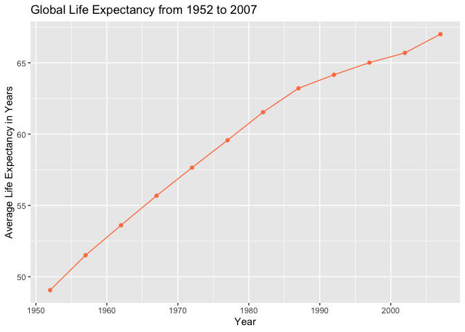
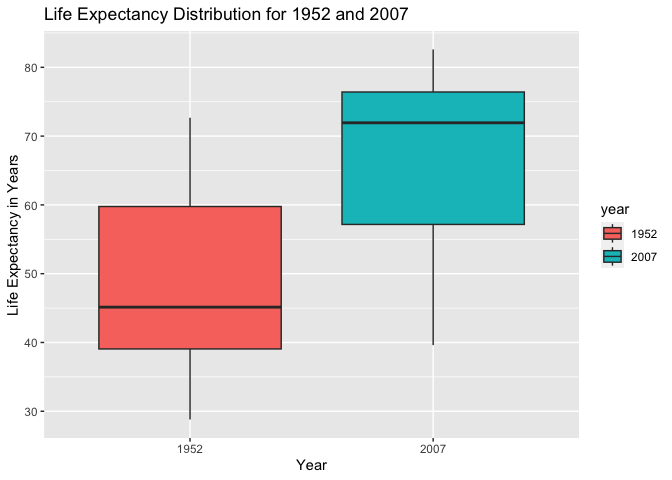
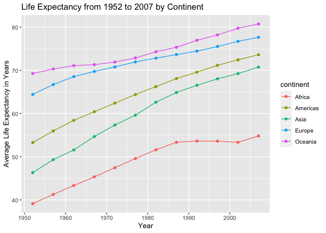
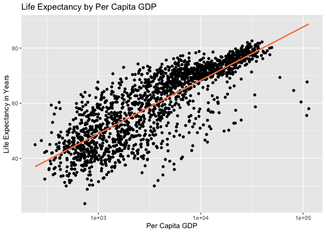
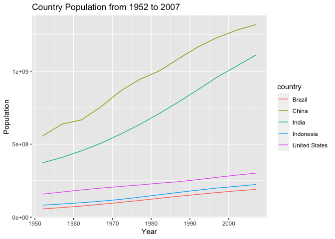
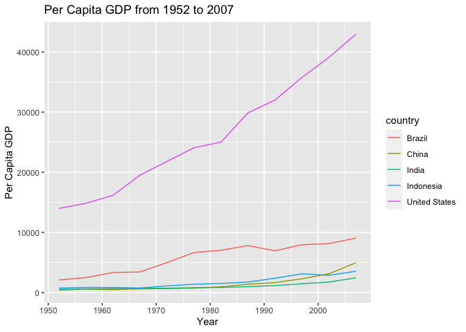
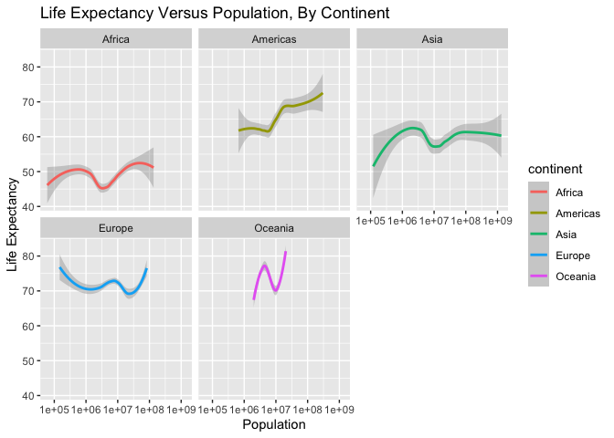

## Instructions
Answer the following questions and complete the exercises in RMarkdown. Please embed all of your code and push your final work to your repository. Your final lab report should be organized, clean, and run free from errors. Remember, you must remove the `#` for the included code chunks to run. Be sure to add your name to the author header above. For any included plots, make sure they are clearly labeled. You are free to use any plot type that you feel best communicates the results of your analysis.  

**In this homework, you should make use of the aesthetics you have learned. It's OK to be flashy!**

Make sure to use the formatting conventions of RMarkdown to make your report neat and clean!  

## Load the libraries

```r
library(tidyverse)
library(janitor)
library(here)
library(naniar)
```

## Resources
The idea for this assignment came from [Rebecca Barter's](http://www.rebeccabarter.com/blog/2017-11-17-ggplot2_tutorial/) ggplot tutorial so if you get stuck this is a good place to have a look.  

## Gapminder
For this assignment, we are going to use the dataset [gapminder](https://cran.r-project.org/web/packages/gapminder/index.html). Gapminder includes information about economics, population, and life expectancy from countries all over the world. You will need to install it before use. This is the same data that we will use for midterm 2 so this is good practice.

```r
# install.packages("gapminder")
library("gapminder")
```

## Questions
The questions below are open-ended and have many possible solutions. Your approach should, where appropriate, include numerical summaries and visuals. Be creative; assume you are building an analysis that you would ultimately present to an audience of stakeholders. Feel free to try out different `geoms` if they more clearly present your results.  

**1. Use the function(s) of your choice to get an idea of the overall structure of the data frame, including its dimensions, column names, variable classes, etc. As part of this, determine how NA's are treated in the data.** 

```r
dim(gapminder)
```

```
## [1] 1704    6
```

```r
names(gapminder)
```

```
## [1] "country"   "continent" "year"      "lifeExp"   "pop"       "gdpPercap"
```

```r
glimpse(gapminder)
```

```
## Rows: 1,704
## Columns: 6
## $ country   <fct> "Afghanistan", "Afghanistan", "Afghanistan", "Afghanistan", …
## $ continent <fct> Asia, Asia, Asia, Asia, Asia, Asia, Asia, Asia, Asia, Asia, …
## $ year      <int> 1952, 1957, 1962, 1967, 1972, 1977, 1982, 1987, 1992, 1997, …
## $ lifeExp   <dbl> 28.801, 30.332, 31.997, 34.020, 36.088, 38.438, 39.854, 40.8…
## $ pop       <int> 8425333, 9240934, 10267083, 11537966, 13079460, 14880372, 12…
## $ gdpPercap <dbl> 779.4453, 820.8530, 853.1007, 836.1971, 739.9811, 786.1134, …
```

```r
summary(gapminder)
```

```
##         country        continent        year         lifeExp     
##  Afghanistan:  12   Africa  :624   Min.   :1952   Min.   :23.60  
##  Albania    :  12   Americas:300   1st Qu.:1966   1st Qu.:48.20  
##  Algeria    :  12   Asia    :396   Median :1980   Median :60.71  
##  Angola     :  12   Europe  :360   Mean   :1980   Mean   :59.47  
##  Argentina  :  12   Oceania : 24   3rd Qu.:1993   3rd Qu.:70.85  
##  Australia  :  12                  Max.   :2007   Max.   :82.60  
##  (Other)    :1632                                                
##       pop              gdpPercap       
##  Min.   :6.001e+04   Min.   :   241.2  
##  1st Qu.:2.794e+06   1st Qu.:  1202.1  
##  Median :7.024e+06   Median :  3531.8  
##  Mean   :2.960e+07   Mean   :  7215.3  
##  3rd Qu.:1.959e+07   3rd Qu.:  9325.5  
##  Max.   :1.319e+09   Max.   :113523.1  
## 
```

```r
view(gapminder)
```


**2. Among the interesting variables in gapminder is life expectancy. How has global life expectancy changed between 1952 and 2007?**

```r
gapminder %>% 
  filter(year >= 1952 & year <= 2007) %>% 
  group_by(year) %>% 
  summarize(mean_lifeExp = mean(lifeExp)) %>% 
  arrange(year)
```

```
## # A tibble: 12 × 2
##     year mean_lifeExp
##    <int>        <dbl>
##  1  1952         49.1
##  2  1957         51.5
##  3  1962         53.6
##  4  1967         55.7
##  5  1972         57.6
##  6  1977         59.6
##  7  1982         61.5
##  8  1987         63.2
##  9  1992         64.2
## 10  1997         65.0
## 11  2002         65.7
## 12  2007         67.0
```

```r
gapminder %>% 
  filter(year >= 1952 & year <= 2007) %>% 
  group_by(year) %>% 
  summarize(mean_lifeExp = mean(lifeExp)) %>% 
  ggplot(aes(x=year, y=mean_lifeExp))+
  geom_line(color="coral")+
  geom_point(color="coral")+
  labs(title = "Global Life Expectancy from 1952 to 2007",
       x = "Year",
       y = "Average Life Expectancy in Years")
```

<!-- -->


**3. How do the distributions of life expectancy compare for the years 1952 and 2007?**

```r
gapminder %>% 
  filter(year==1952 | year==2007) %>% 
  mutate(year=as.factor(year)) %>%
  ggplot(aes(x=year, y=lifeExp, group=year, fill=year))+
  geom_boxplot()+
  labs(title = "Life Expectancy Distribution for 1952 and 2007",
       x = "Year",
       y = "Life Expectancy in Years")
```

<!-- -->


**4. Your answer above doesn't tell the whole story since life expectancy varies by region. Make a summary that shows the min, mean, and max life expectancy by continent for all years represented in the data.**

```r
gapminder %>% 
  group_by(continent) %>% 
  summarize(mean_continent_lifeExp = mean(lifeExp),
            min_continent_lifeExp = min(lifeExp),
            max_continent_lifeExp = max(lifeExp))
```

```
## # A tibble: 5 × 4
##   continent mean_continent_lifeExp min_continent_lifeExp max_continent_lifeExp
##   <fct>                      <dbl>                 <dbl>                 <dbl>
## 1 Africa                      48.9                  23.6                  76.4
## 2 Americas                    64.7                  37.6                  80.7
## 3 Asia                        60.1                  28.8                  82.6
## 4 Europe                      71.9                  43.6                  81.8
## 5 Oceania                     74.3                  69.1                  81.2
```


**5. How has life expectancy changed between 1952-2007 for each continent?**

```r
gapminder %>% 
  group_by(year, continent) %>% 
  summarize(mean_continent_lifeExp = mean(lifeExp), .groups='keep') %>% 
  ggplot(aes(x=year, y=mean_continent_lifeExp, group=continent, color=continent))+
  geom_line()+
  geom_point()+
  labs(title = "Life Expectancy from 1952 to 2007 by Continent",
       x = "Year",
       y = "Average Life Expectancy in Years")
```

<!-- -->


**6. We are interested in the relationship between per capita GDP and life expectancy; i.e. does having more money help you live longer?**

```r
gapminder %>% 
  ggplot(aes(x=gdpPercap, y=lifeExp))+
  geom_jitter()+
  geom_smooth(method=lm, se=F, color="coral")+
  scale_x_log10()+
  labs(title = "Life Expectancy by Per Capita GDP",
       x = "Per Capita GDP",
       y = "Life Expectancy in Years")
```

```
## `geom_smooth()` using formula = 'y ~ x'
```

<!-- -->


**7. Which countries have had the largest population growth since 1952?**

```r
gapminder %>% 
  select(country, year, pop) %>% 
  filter(year==1952 | year==2007) %>%
  pivot_wider(names_from = year,
              values_from = pop,
              names_prefix = "yr_") %>% 
  mutate(pop_growth = yr_2007 - yr_1952) %>% 
  arrange(desc(pop_growth)) %>% 
  head(n=5)
```

```
## # A tibble: 5 × 4
##   country         yr_1952    yr_2007 pop_growth
##   <fct>             <int>      <int>      <int>
## 1 China         556263527 1318683096  762419569
## 2 India         372000000 1110396331  738396331
## 3 United States 157553000  301139947  143586947
## 4 Indonesia      82052000  223547000  141495000
## 5 Brazil         56602560  190010647  133408087
```


**8. Use your results from the question above to plot population growth for the top five countries since 1952.**

```r
gapminder %>% 
  filter(country=="China" | country=="India" | country=="United States" | country=="Indonesia" | country=="Brazil") %>% 
  ggplot(aes(x=year, y=pop, group=country, color=country))+
  geom_line()+
  labs(title = "Country Population from 1952 to 2007",
       x = "Year",
       y = "Population")
```

<!-- -->


**9. How does per-capita GDP growth compare between these same five countries?**

```r
gapminder %>% 
  filter(country=="China" | country=="India" | country=="United States" | country=="Indonesia" | country=="Brazil") %>% 
  ggplot(aes(x=year, y=gdpPercap, group=country, color=country))+
  geom_line()+
  labs(title = "Per Capita GDP from 1952 to 2007",
       x = "Year",
       y = "Per Capita GDP")
```

<!-- -->


**10. Make one plot of your choice that uses faceting!**

```r
names(gapminder)
```

```
## [1] "country"   "continent" "year"      "lifeExp"   "pop"       "gdpPercap"
```

```r
gapminder %>% 
  ggplot(aes(x=pop, y=lifeExp, color=continent))+
  geom_smooth()+
  facet_wrap(continent~.)+
  scale_x_log10()+
  labs(title = "Life Expectancy Versus Population, By Continent",
       x = "Population",
       y = "Life Expectancy")
```

```
## `geom_smooth()` using method = 'loess' and formula = 'y ~ x'
```

<!-- -->


## Push your final code to GitHub!
Please be sure that you check the `keep md` file in the knit preferences. 
